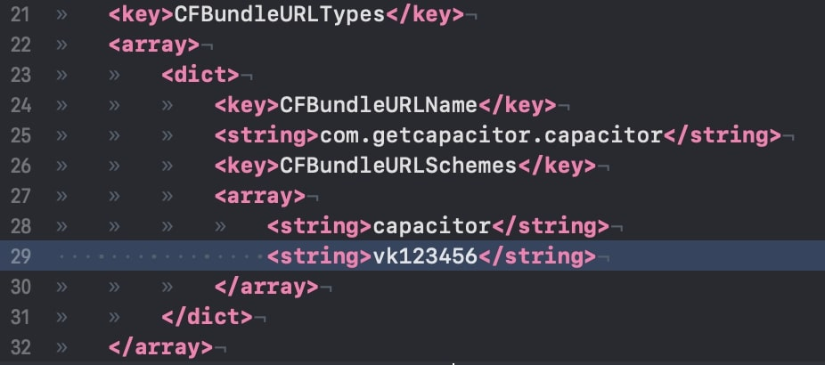

# Capacitor Plugin VK Auth

## Install
Use Yarn
```
yarn add capacitor-plugin-vk-auth
```
Use NPM
```
npm install capacitor-plugin-vk-auth --save
```


## Android

Setup App in vk.com/dev

[Click to open useful docs for android](https://vk.com/dev/android_sdk?f=1.%20%D0%9F%D0%BE%D0%B4%D0%B3%D0%BE%D1%82%D0%BE%D0%B2%D0%BA%D0%B0%20%D0%BA%20%D0%B8%D1%81%D0%BF%D0%BE%D0%BB%D1%8C%D0%B7%D0%BE%D0%B2%D0%B0%D0%BD%D0%B8%D1%8E)

Add plugin registration line


Add VK APP ID to app/res/values/strings.xml


## IOS

Insert vkID into your `Info.plist` file like this



[Click to open useful docs for ios](https://vk.com/dev/ios_sdk?f=1.%20%D0%9F%D0%BE%D0%B4%D0%B3%D0%BE%D1%82%D0%BE%D0%B2%D0%BA%D0%B0%20%D0%BA%20%D0%B8%D1%81%D0%BF%D0%BE%D0%BB%D1%8C%D0%B7%D0%BE%D0%B2%D0%B0%D0%BD%D0%B8%D1%8E)

### Only for IOS 9
[Click to open settings for IOS 9](https://vk.com/dev/ios_sdk?f=1.2.%20%D0%98%D0%B7%D0%BC%D0%B5%D0%BD%D0%B5%D0%BD%D0%B8%D1%8F%20%D0%B4%D0%BB%D1%8F%20iOS%209)
